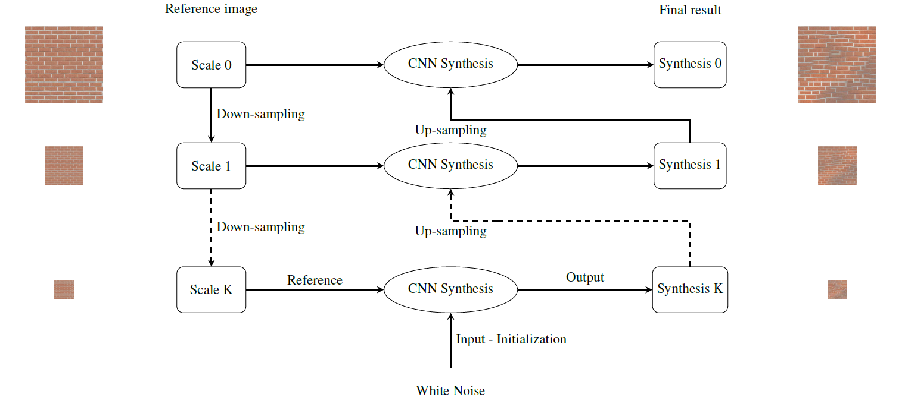

# Multi-resolution Texture Synthesis with CNN

Code to reproduce synthesis results of our multi-resolution texture synthesis with CNN. This repository is associated to the research paper: [High resolution neural texture synthesis with long range constraints](https://arxiv.org/abs/2008.01808) with [Nicolas Gonthier](https://perso.telecom-paristech.fr/gonthier/), [Yann Gousseau](https://perso.telecom-paristech.fr/gousseau/) and [Saïd Ladjal](https://perso.telecom-paristech.fr/ladjal/)

**tl;dr** 

We introduce a simple multi-resolution framework that consists in using the synthesis at the lower scale as initialization for the next scale. This framework can be with different statistical constraints :
- Gram matrices of the features of the VGG and the [power spectrum of the image](https://arxiv.org/abs/1605.01141)
- Autocorrelation of the features of the VGG (without use of the Gram matrices constraints)

[arXiv](https://arxiv.org/abs/2008.01808) | [BibTeX](#bibtex) 

## BibTeX

```
@misc{gonthier2020high,
      title={High resolution neural texture synthesis with long range constraints}, 
      author={Nicolas Gonthier Esser and Yann Gousseau and Saïd Ladjal},
      year={2020},
      eprint={2008.01808},
      archivePrefix={arXiv},
      primaryClass={cs.CV}
}
```
