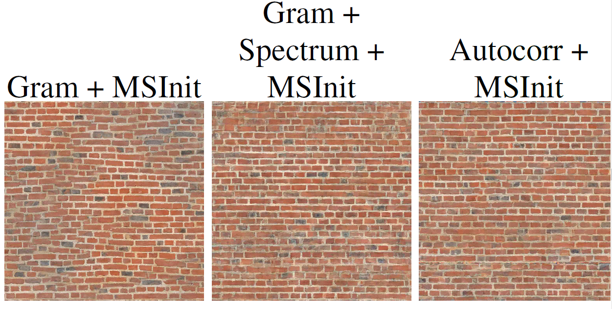

# Multi-resolution Texture Synthesis with CNN

Code to reproduce synthesis results of our multi-resolution texture synthesis with CNN. This repository is associated to the research paper: [High resolution neural texture synthesis with long range constraints](https://arxiv.org/abs/2008.01808) with [Nicolas Gonthier](https://perso.telecom-paristech.fr/gonthier/), [Yann Gousseau](https://perso.telecom-paristech.fr/gousseau/) and [Saïd Ladjal](https://perso.telecom-paristech.fr/ladjal/)

**tl;dr** 

We introduce a simple multi-resolution framework that consists in using the synthesis at the lower scale as initialization for the next scale. This framework can be with different statistical constraints :
- Gram matrices of the features of the VGG and the [power spectrum of the image](https://arxiv.org/abs/1605.01141)
- Autocorrelation of the features of the VGG (without use of the Gram matrices constraints)

[arXiv](https://arxiv.org/abs/2008.01808) | [BibTeX](#bibtex) 


## Requirements
You can install the required packages in your local environment by using the rquirements.txt file. 
This code have been tested with Python 3.6 and [Tensorflow 1.5](https://www.tensorflow.org/versions/r1.15/api_docs/python/tf?hl=fr).
We advice you to use a [conda](https://conda.io/) environment and the GPU version of Tensorflow.
Moreover, this code have not been tested with Tensorflow 2.

```
pip install -r requirements.txt
```

Consider using the `--user` option if you do not have all the permissions.

## Synthesis Texture

### Gatys et al. Texture Synthesis

To synthesis a new texture sample with the [Gatys et al. 2015](https://arxiv.org/abs/1505.07376) model based on the Gram matrices, you can use the following command :
The `-s` option is the reference image name, the `-o` is the output image name. The name of the folder containing the reference image can be change by using the `--img_folder` option and the output folder with the `--img_output_folder` one.


```
python Run_synthesis.py -s TilesOrnate0158_1_S -o synthesis --img_folder images --img_output_folder output
```

### Gatys Multiscale

To use the multiscale strategy you just need to add the `--MS_Strat` option as shown in the following command:
```
python Run_synthesis.py -s TexturesCom_BrickSmallBrown0473_1_M_1024 -o synthesis --MS_Strat Init --K 2
```
The `--K` option is the number of scale to use.

### Using an additional spectrum constraint

The `--loss` option can be used to add the spectrum contraint (on the input image) in the following way:
```
python Run_synthesis.py -s TilesOrnate0158_1_S -o synthesis --loss Gram spectrum --beta_spectrum 100000
```
This option must be followed by a list of loss to use. And the `--beta_spectrum` option is the weighting ratio between the Gram based loss and the spectrum one.
Without the multi-scale strategy, this method is the [Liu et al. 2016](https://arxiv.org/abs/1605.01141) one.

The Gram + spectrum model can be used in a multi-scale manner:
```
python Run_synthesis.py -s TexturesCom_BrickSmallBrown0473_1_M_1024 -o synthesis --loss Gram spectrum --beta_spectrum 100000 --MS_Strat Init --K 2
```


### Autocorrelation of the feature maps

The model based only on the autocorrelation of the feature maps (without Gram matrices) can be used as following:
```
python Run_synthesis.py -s TilesOrnate0158_1_S -o synthesis --loss autocorr
```
And to use the multiscale pipeline, you just need to use this command:
```
python Run_synthesis.py -s TexturesCom_BrickSmallBrown0473_1_M_1024 -o synthesis --loss autocorr --MS_Strat Init --K 2
```


### Other options

Other options are available with this script you can refer to the Arg_Parser.py file such as the optimizer, the number of iterations.

## VGG pretrained weights

The normalizedvgg.mat file is the VGG19 network with the weights normalized by Gatys et al. and it is the [Caffe model](https://github.com/leongatys/DeepTextures) converted in MatConvNet format by us.

This code can also be used with the pretained weights from [Simonyan and Zisserman](https://arxiv.org/abs/1409.1556) that can be found [here](http://www.vlfeat.org/matconvnet/models/imagenet-vgg-verydeep-19.mat).

## BibTeX

```
@misc{gonthier2020high,
      title={High resolution neural texture synthesis with long range constraints}, 
      author={Nicolas Gonthier Esser and Yann Gousseau and Saïd Ladjal},
      year={2020},
      eprint={2008.01808},
      archivePrefix={arXiv},
      primaryClass={cs.CV}
}
```
